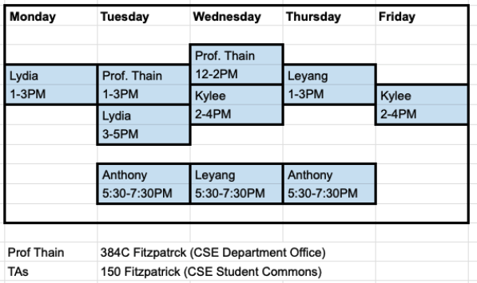

## CSE 30341 - Operating Systems Principles - Spring 2025

- Prof. Douglas Thain (`dthain@nd.edu`)
- Grad TA: Lydia Csaszar (`lcsaszar@nd.edu`)
- Grad TA: Kylee Kazenski (`kkazensk@nd.edu`)
- Ugrad TA: Anthony Tsiantis (`atsianti@nd.edu`)
- Ugrad TA: Leyang Li (`lli27@nd.edu`)

## Quick Links

- [Syllabus](syllabus)
- [General Instructions for Assignments](general)
- [Gradebook on Canvas](https://canvas.nd.edu/courses/109948/gradebook)
- [Assignments on Canvas](https://canvas.nd.edu/courses/109948/assignments)
- [Slack Channel](https://app.slack.com/client/T0HJVP8MS/C087P2MUKNY)

## Office Hours (Starting Week of Jan 20)

- `***` indicates not first week
- TAs in 150B Fitzpatrick (CSE student commons)
- Prof. Thain in 384C Fitzpatrick (CSE Department Office)

## Textbooks

- Required: [Operating Systems in Three Easy Pieces](https://pages.cs.wisc.edu/~remzi/OSTEP), Remzi H. Arpaci-Dusseau and Andrea C. Arpaci-Dusseau, Arpaci-Dusseau Books, March, 2018 (Version 1.00)
- For Reference: [Dive Info Systems](https://diveintosystems.org/book), Suzanne Matthews, Tia Newhall, and Kevin Webb, 2020.

## Tentative Schedule

|Week|Reading&nbsp;Due Mon&nbsp;11:59PM |Tuesday|Thursday|Due Friday 5:00PM|
|-----|-----|-----|---|---|
| 13 Jan  |             | [Intro&nbsp;Slides](https://docs.google.com/presentation/d/1Udc71mn21lsMWi7hFo3tQoJvWjSfK9IhL9SEAKE8Iyk/edit#slide=id.p1) [Syllabus](syllabus) [OS-List](os-list)  | [Hardware](hardware)  [Metric Math](metric)   [BK:Interrupts](basekernel#interrupts) | **[Homework A](homework-a)** **Ch 1-2 Notes Due**
| 20 Jan  | Ch. 3-6	| Process API | Process Implementation [BK:Processes](basekernel#processes) | **[Project 1](project1)**
| 27 Jan  | Ch. 7-11	| Scheduling   | Scheduling	| **[Homework B](homework-b)**
| 3 Feb   | Ch. 25-29	| Threads	 | Locks and Data Structures | **[Project 2](project2)**
| 10 Feb  | Ch. 30	| Condition Vars | CV Contd [Examples](https://github.com/dthain/opsys-sp25-examples) | **[Homework C](homework-c)**
| 17 Feb  | Ch. 31	| CV Contd [Pathfinder](https://www.cs.cornell.edu/courses/cs614/1999sp/papers/pathfinder.html)    | Semaphores [Examples](https://github.com/dthain/opsys-sp25-examples) | **[Project 3](project3)**
| 24 Feb  | Ch. 32-33	| Deadlock	 | Memory Overview | [Homework D](homework-d)
| 3 Mar   | Ch. 13-16   | Segmentation   | [Midterm Exam](midterm) |
| 10 Mar  | -           | Spring Break   | Spring Break |
| 17 Mar  | Ch. 17-19	| Paging Mechanisms | TLBs / Performance	| 
| 24 Mar  | Ch. 20-22	| Multi-Level Paging | Swapping	| [**Project 4**](project4)
| 31 Mar  | Ch. 35-37 + 44 | Swapping Cont. | I/O Devices ([Mouse](https://github.com/dthain/basekernel/blob/master/kernel/mouse.c) / [Disk](https://github.com/dthain/basekernel/blob/master/kernel/ata.c))  | [Homework E](homework-e)
| 7 Apr   | Ch. 38-39	| HDD [Datasheet](datasheets/seagate-st8000-hdd.pdf) SSD [Datasheet](micron-2280-ssd.pdf) | Buffer Cache | **Project 5**
| 14 Apr  | Ch. 40-42	| Filesystem     | Filesystem | (Easter Break)
| 21 Apr  | Ch. 53-55	| Security       | Security | [Homework F](homework-f)
| 28 Apr  | -           | Review | No Class | **Project 6**
| 5 May	  |             |                | **Final Exam** **May 8th** **7:30-9:30PM** |

