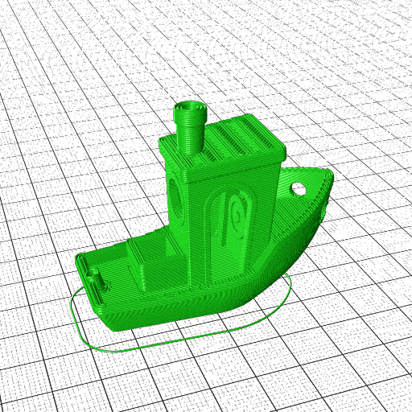
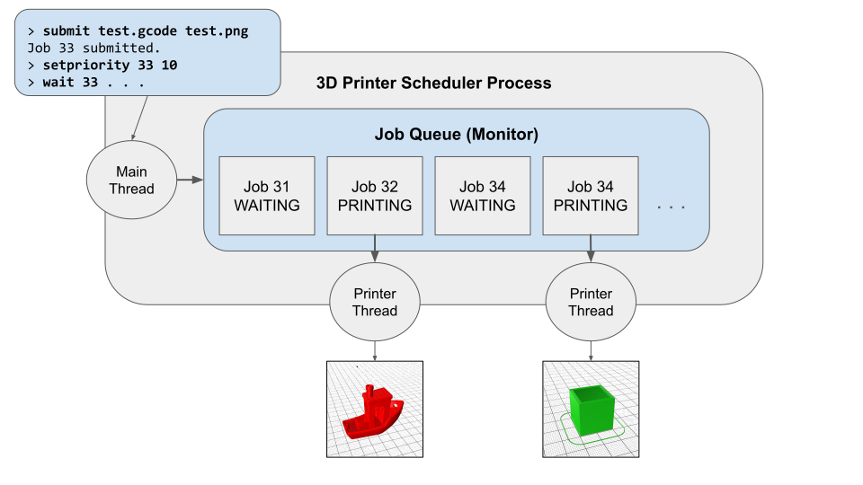

# Project 4 - 3D Printer Scheduler

Please review the [general instructions](../general) for assignments.

The goals of this project are:
- To demonstrate mastery of process and thread management.
- To practice working with synchronized data structures.
- To gain experience with asynchronous job scheduling.

Overview
--------

Consider what happens when you have a large number of jobs to accomplish,
but you cannot simply run them all at once simultaneously: downloading
lots of large files, sending models to a 3D-printer, rendering lots of
frames for a movie, processing credit card payments, etc.
To manage a large amount of work, you need a **job scheduler** which will
accept submissions, arrange for them to execute, and report back information
to ther user.

3D Printer Simulator
--------------------

In this project, you will build a job scheduler for a studio full
of 3D printers.  Such printers (as well as industrial CNC machines) take
input in the form of G-Code, a sequence of three dimensional drawing
instructions that looks like this:

```
G00 X246.00 Y250.00
G02 X254.00 Y250.00 I250.00 J250.00
G02 X246.00 Y250.00 I250.00 J250.00
G01 X262.75 Y250.00
G01 X262.75 Y472.63
G00 X258.75 Y472.63
. . .
```

Briefly, G00 indicates a fast repositioning move to an X Y position, G01 indicates a linear
movement at a standard feed rate, and G02 indicates a circular arc.  There
are many more codes, and you can read [more here](https://howtomechatronics.com/tutorials/g-code-explained-list-of-most-important-g-code-commands).

So that you don't have to carry around a bunch of printers, we will
give you a simulator `gcode2png` that reads simplified G-code and
produces an image file, instead of a printed object.  We have deliberately
slowed down the rendering code so that the printing takes some time to complete.
Your job is to build a scheduler that will keep several printers busy at once.

Software Installation
-------------------

To get started with this project, you will need to make a custom software environment.

First, download this starter code respository:
```
git clone https://github.com/dthain/opsys-sp25-project4-starter
cd opsys-sp25-project4-starter
```

Next create a `conda` environment called `opsys-project4`
to contain the various software dependencies.  `conda` allows you to install a wide variety of software without root privileges, and maintain separate environments
for different projects.

You may have installed `conda` in a prior class.
Check to see if this command already works:

```
conda list
```

If that doesn't work, then install `conda` into your home directory from [miniforge](https://github.com/conda-forge/miniforge) like this:

```
curl -L -O "https://github.com/conda-forge/miniforge/releases/latest/download/Miniforge3-Linux-x86_64.sh"
bash Miniforge3-Linux-x86_64.sh
```

Then, create an environment called `opsys-project4` and enter into it:

```
conda create -n opsys-project4
conda activate opsys-project4
conda install -c conda-forge povray
```

You only need to do the above steps once to get started.
If you are returning to your work later, you just need to re-activate
the software environment and enter the proper directory:

```
conda activate opsys-project4
cd opsys-sp25-project4-starter
```

Now check that you can run a single print job like this:

```
./gcode2png examples/3DBenchy.gcode --output=3DBenchy.png
```

Which should give you this:



The Printer Scheduler
---------------------

Your goal is to build a program called **printsched** for managing
multiple 3D printers.  When started, it should accept a fixed
number of printers to simulate as a command line argument.
Then, it should print out a prompt and wait for input from the user.
The available commands should be:

```
submit      <file.gcode> <file.png>
list
wait        <jobid>
waitany
waitall
remove      <jobid>
setpriority <jobid> <priority>
algo        <fifo|sjf|priority|balanced>
quit
help
```

The **submit** command defines a new print job, names the gcode
file to execute on the printer, and the name of the intended output file.
**submit** should return immediately and display a unique integer job ID
generated internally by your program.
(Just start at one and count up.)  The job will then run in the background
when selected by the scheduler.  Each simulated printer will pop open a window and start drawing.

The **list** command lists all of the jobs currently known,
giving the job id, current state (WAITING, PRINTING, COMPLETE) and filename.
It should also state the average turnaround time and average response
time of all jobs in the COMPLETE state.
You can format this output in any way that is consistent and easy to read.

The **wait** command takes a specific jobid and blocks until that job is
done printing.  Once complete, it should display the final status
of the job (success or failure) and the time at which it was submitted,
began printing, and completed.  (If the job was already complete,
then it should just display the relevant information immediately.)

In a similar way, **waitany** should wait for any one job to complete,
and **waitall** should wait for all jobs to complete.

The **remove** command takes a jobid and then removes it from
the queue.  However, a job cannot be removed if it is currently
in the PRINTING state. In this case, display a suitable error and
refuse to remove the job.

The **setpriority** command should adjust the priority of a job
after submission.

The **algo** command should select the scheduling algorithms
to be used by the printers: `fcfs` is first-come-first-served,
`sjf` is shortest-job-first, an `priority` should run jobs in priority
order.  `balanced` should generally prefer short and high-priority jobs,
but also make some accomodation to ensure that no job is starved indefinitely.

The **quit** command should immediately exit the program,
regardless of any jobs in the queue.  (If end-of-file is detected
on the input, the program should quit in the same way.)

The **help** command should display the available commands
in a helpful manner.


Implementation Advice
---------------------

This project will bring together a variety of concepts that you have
studied so far: process management, thread synchronization,
and scheduling.  We aren't going to talk through every little function
you should use; you will need to review prior material and look up
documentation as needed.

Here is the basic architecture you should use:



The program should consists of several threads: one main thread and several
printer threads, which interact through a common job queue.
The main thread interacts with the user by reading commands, submitting jobs to 
the queue, displaying status, and so forth.

Each printer is represented by a thread that works in the background.
Each thread should select the next job to run (based on the current scheduling
algorithm), render the print job by running the simulator program
as a separate external process, and then updating the job queue when that process is complete.

The tricky part of this assignment is the job queue itself.
The job queue should be implemented as a **monitor** as discussed
in class: a data structure that is protected by a **mutex**
and a **condition variable**.  The job queue should
only be accessed by functions that take care to use the mutex
for mutual exclusion and the condition variable to sleep and wakeup.

Generally speaking, the main thread should remain responsive to
the user by only performing quick actions on the job queue.
The user ought to be able to see immediate response to all commands,
except those that specifically wait for a job to complete.

Testing
-------

Test your scheduler carefully by using it to run a variety of jobs,
both short and long, in different orders.  Try different combinations
of operations: submitting, waiting, removing, etc.  Try the different
scheduling algorithms, and verify that the statistics reported are correct
for the jobs that actually run.  Try running with different numbers
of printers, and check that all are kept appropriately busy.
Think critically about unexpected
events, such as improper input from the user, incorrect arguments to
commands, and so forth.  Whenever such an unexpected event occurs,
you should display a detailed and helpful error message, and
(where possible) continue operation of the program.

A particularly useful  way to test is to create small input files
that contain a sequence of operations. For example, create `test1.txt`
containing this:

```
submit example.gcode example.png
list
setpriority 1 10
list
wait 1
remove 1
list
quit
```

Then, just run your scheduler with input redirected from that file:
```
./printsched 3 < test1.txt
```

Turning In
----------

Please review the [general instructions](../general) for assignments.

Turn in the following:

- All of your `.c` and `.h` files making up `printsched`.
- A Makefile that builds `printsched` when the user types `make`,
and cleans up all executables and object files on `make clean`.
- A `README` that briefly explains your code structure, and describes how your `balanced` algorithm works.

This assignment is due at **5:00PM on Friday, March 28th**

Grading
-------

Your grade will be based on:
- 40% - Correct implementation of each of the interactive commands.
- 30% - Correct behavior of the background printer threads.
- 20% - Correct synchronization techniques in the job queue.
- 10% - Good coding style, including clear formatting, sensible variable names, and useful comments.
